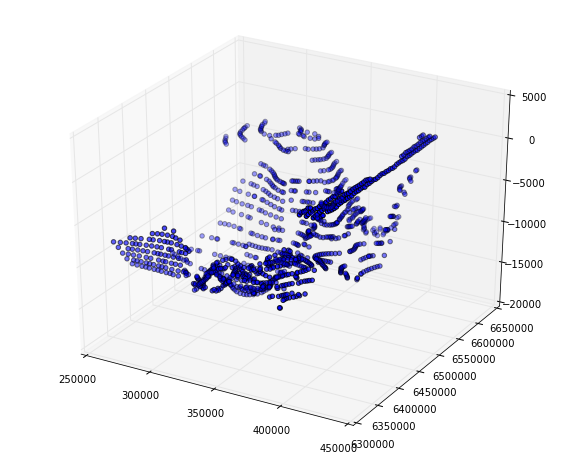
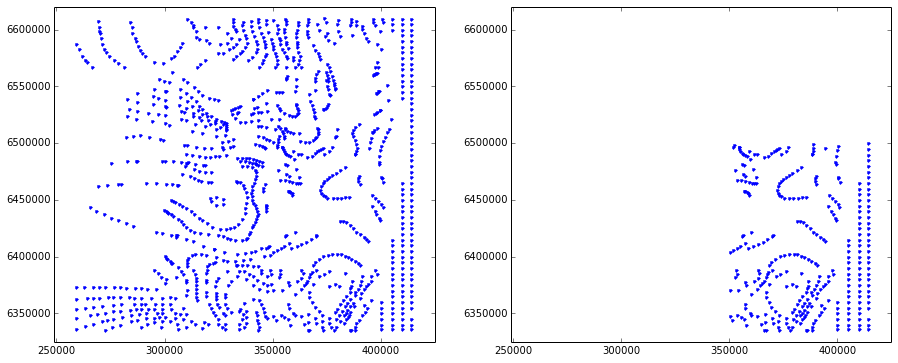

Analysis and modification of exported 3D Structural Data
========================================================

All structural data from an entire GeoModeller project can be exported
into ASCII files using the function in the GUI:

Export -> 3D Structural Data

This method generates files for defined geological parameters:

-  "Points" (i.e. formation contact points) and
-  "Foliations" (i.e. orientations/ potential field gradients).

Exported parameters include all those defined in sections as well as 3D
data points.

The ``struct_data`` package contains methods to check, visualise, and
extract/modify parts of these exported data sets, for example to import
them into a different Geomodeller project. Several of these methods will
be explained and tested in this notebook.

The export function generates files with the endings ``_Foliations.csv``
and ``_Points.csv``. Classes for both of these data sets are available
to handle them accordingly.

.. code:: python

    # import module
    import sys
    # as long as not in Pythonpath, we have to set directory:
    sys.path.append(r'/Users/flow/git/pygeomod')
    import struct_data
.. code:: python

    %pylab inline

.. parsed-literal::

    Populating the interactive namespace from numpy and matplotlib

.. parsed-literal::

    WARNING: pylab import has clobbered these variables: ['norm']
    `%matplotlib` prevents importing * from pylab and numpy

Point data sets
---------------

We will first start with reading and analysing the point data sets:

.. code:: python

    # only required during testing stage
    reload(struct_data)
    # use example data
    pts = struct_data.Struct3DPoints(filename = r'../data/wt_Points.csv')
.. code:: python

    pts.get_formation_names()
    pts.formation_names

.. parsed-literal::

    array(['Basement', 'CPB_Fault_01', 'CPB_Fault_02', 'CPB_Fault_03',
           'CPB_Fault_04', 'CPB_Fault_05', 'CPB_Fault_06', 'CPB_Fault_07',
           'CPB_Fault_08', 'CPB_Fault_09', 'CPB_Fault_10',
           'CPB_Fault_11_Serpentine', 'CPB_Fault_12_Darling', 'CPB_Fault_13',
           'CPB_Fault_14', 'CPB_Fault_15', 'CPB_Fault_16',
           'CPB_Fault_Transverse_02', 'CPB_Fault_Transverse_03',
           'CPB_Fault_Transverse_04', 'CPB_Fault_Transverse_05',
           'Cattamarra_Coal_Measures', 'Eneabba_Fm', 'Gage_Ss',
           'Kockatea_Shale', 'Late_Triassic', 'Leederville_Fm', 'Lesueur_Ss',
           'Lower_crust', 'Moho', 'Neocomian_Unc', 'Permian', 'Sea_level',
           'South_Perth_Sh', 'Topo', 'Yarragadee_Fm', 'Yilgarn'], 
          dtype='|S32')

.. code:: python

    pts.plot_plane()

.. image:: 3D-Structural-Data_files/3D-Structural-Data_6_0.png

Or, a bit more complex plotting options:

.. code:: python

    fig = plt.figure(figsize = (18,6))
    ax1 = fig.add_subplot(131)
    ax2 = fig.add_subplot(132)
    ax3 = fig.add_subplot(133)
    pts.plot_plane(ax = ax1)
    pts.plot_plane(plane = ('x','z'), ax = ax2, color = 'k')
    pts.plot_plane(plane = ('y','z'), ax = ax3, color = 'r')

.. image:: 3D-Structural-Data_files/3D-Structural-Data_8_0.png

We can also create plots of points for specified formations only:

.. code:: python

    fig = plt.figure(figsize = (18,6))
    ax1 = fig.add_subplot(131)
    ax2 = fig.add_subplot(132)
    ax3 = fig.add_subplot(133)
    pts.plot_plane(ax = ax1, formation_names = ['Basement'])
    pts.plot_plane(ax = ax2, formation_names = ['Yarragadee_Fm'], color = 'k')
    pts.plot_plane(ax = ax3, formation_names = ['Lesueur_Ss'], color = 'r')

.. image:: 3D-Structural-Data_files/3D-Structural-Data_10_0.png

It is also possible to create 3-D perspective plots (not many options
yet, but a lot more could be included):

.. code:: python

    pts.plot_3D(formation_names = ['Basement'])

.. image:: 3D-Structural-Data_files/3D-Structural-Data_12_0.png

.. code:: python

    pts.formation_names

.. parsed-literal::

    array(['Basement', 'CPB_Fault_01', 'CPB_Fault_02', 'CPB_Fault_03',
           'CPB_Fault_04', 'CPB_Fault_05', 'CPB_Fault_06', 'CPB_Fault_07',
           'CPB_Fault_08', 'CPB_Fault_09', 'CPB_Fault_10',
           'CPB_Fault_11_Serpentine', 'CPB_Fault_12_Darling', 'CPB_Fault_13',
           'CPB_Fault_14', 'CPB_Fault_15', 'CPB_Fault_16',
           'CPB_Fault_Transverse_02', 'CPB_Fault_Transverse_03',
           'CPB_Fault_Transverse_04', 'CPB_Fault_Transverse_05',
           'Cattamarra_Coal_Measures', 'Eneabba_Fm', 'Gage_Ss',
           'Kockatea_Shale', 'Late_Triassic', 'Leederville_Fm', 'Lesueur_Ss',
           'Lower_crust', 'Moho', 'Neocomian_Unc', 'Permian', 'Sea_level',
           'South_Perth_Sh', 'Topo', 'Yarragadee_Fm', 'Yilgarn'], 
          dtype='|S32')

.. raw:: html

   <h3>

Generate subset for defined formations

.. raw:: html

   </h3>

It is often required to generate a subset of the points, either for
specified formations only (although that could also be done during the
input in GeoModeller...), or for a defined range/ extent. These options
are possible with the package, and selections can be stored to new
files:

.. code:: python

    # only required during testing stage
    reload(struct_data)
    # use example data
    pts = struct_data.Struct3DPoints(filename = r'../data/wt_Points.csv')
    pts_subset = pts.create_formation_subset(['Basement'])
.. code:: python

    pts_subset.len

.. parsed-literal::

    1209

.. code:: python

    pts_subset.plot_3D()

.. raw:: html

   <h3>

Generating a subset for a subvolume

.. raw:: html

   </h3>

It is also possible to extract data in only a specified range. The range
is defined with keywords, e.g. ``from_x = xx``, ``to_x = xx``. All other
ranges (not stated) are simply kept as before.

Here an example:

.. code:: python

    # only required during testing stage
    reload(struct_data)
    # use example data
    pts = struct_data.Struct3DPoints(filename = r'../data/wt_Points.csv')

.. code:: python

    pts.xmin, pts.xmax, pts.ymin, pts.ymax

.. parsed-literal::

    (259000.0, 415000.0, 6335020.0, 6610000.0)

.. code:: python

    pts_subset = pts.extract_range(from_x = 350000., to_y = 6500000)
Now let's compare the two sets in a plot:

.. code:: python

    fig = plt.figure(figsize = (15,6))
    ax1 = fig.add_subplot(121)
    ax2 = fig.add_subplot(122)
    pts.plot_plane(ax = ax1, formation_names = ['Basement'])
    pts_subset.plot_plane(ax = ax2, formation_names = ['Basement'])
    # set ranges to compare plots
    ax1.set_xlim((pts.xmin-10000, pts.xmax+10000))
    ax1.set_ylim((pts.ymin-10000, pts.ymax+10000))
    ax2.set_xlim((pts.xmin-10000, pts.xmax+10000))
    ax2.set_ylim((pts.ymin-10000, pts.ymax+10000))

.. parsed-literal::

    (6325020.0, 6620000.0)

.. raw:: html

   <h3>

Thin data

.. raw:: html

   </h3>

In many cases, a lot of data has been digitised for specific locations.
This can lead to problems with the kriging interpolation in Geomodeller.
A simple function to thin data is implemented here to avoid this
problem. The method is really simple and can be quite compute intense
(for smalll grids), so check what you are doing!

Note: If spatial data is imported, Geomodeller actually has a
functionality for a type of "thinning" - if you work with this data
(e.g. digitised from MapInfo), then this might be the function to use...

The thinning is performed for **the entire set** and **not aware of
formations** (so far...) and works on a grid/ raster base for defined
number of cells in each axis direction of ``nx, ny, nz``. The best
procedure is therefore to first create a subset for one formation, and
then to perform the thinning for this subset:

.. code:: python

    # only required during testing stage
    reload(struct_data)
    # use example data
    pts = struct_data.Struct3DPoints(filename = r'../data/wt_Points.csv')
    pts_sub1 = pts.create_formation_subset('Permian')
Let's have a look at one formation, the Permian. We can clearly see the
dense data in the overlapping regions and the highly defined traces
through the model:

.. code:: python

    fig = plt.figure(figsize = (16,6))
    ax1 = fig.add_subplot(121, projection='3d')
    ax2 = fig.add_subplot(122)
    ax1.view_init(elev=30, azim=70)
    pts_sub1.plot_3D(ax = ax1)
    pts_sub1.plot_plane(ax = ax2)

.. image:: 3D-Structural-Data_files/3D-Structural-Data_27_0.png

We want to thin this now with a grid which is ``n`` times smaller than
the extent in each direction:

.. code:: python

    nx = 20
    ny = 20
    nz = 20
    
    pts_sub2 = pts_sub1.thin(nx, ny, nz)
.. code:: python

    pts_sub1.len, pts_sub2.len

.. parsed-literal::

    (810, 319)

And compare those to the set above in a plot:

.. code:: python

    fig = plt.figure(figsize = (16,6))
    ax1 = fig.add_subplot(121, projection='3d')
    ax2 = fig.add_subplot(122)
    ax1.view_init(elev=30, azim=70)
    pts_sub2.plot_3D(ax = ax1)
    pts_sub2.plot_plane(ax = ax2)

.. image:: 3D-Structural-Data_files/3D-Structural-Data_32_0.png

Nice, it seems to work (surprised myself...)

Of course, it's up to the user to evaluate if the thinning is creating
"wrong" Geomodels afterwards... good luck!

.. raw:: html

   <h3>

Combine two point sets

.. raw:: html

   </h3>

It might be important to combine datasets, for example after thinning
two different geological formations. As an example, we will combine the
thinned Permian data set from above with the (complete) set for the
Basement:

.. code:: python

    # only required during testing stage
    reload(struct_data)
    # use example data
    pts = struct_data.Struct3DPoints(filename = r'../data/wt_Points.csv')
    pts_sub3 = pts.create_formation_subset('Basement')
    # create a copy for comparison:
    pts_sub3b = pts.create_formation_subset('Basement')
    
    pts_sub3.combine_with(pts_sub2)
    
    # create a plot of all three point sets:
    fig = plt.figure(figsize = (18,6))
    ax1 = fig.add_subplot(131)
    ax2 = fig.add_subplot(132)
    ax3 = fig.add_subplot(133)
    pts_sub3b.plot_plane(('x','z'), ax = ax1)
    pts_sub2.plot_plane(('x','z'), ax = ax2, color='r')
    pts_sub3.plot_plane(('x','z'), ax = ax3)
    ax1.set_ylim((pts_sub3.zmin, pts_sub3.zmax))
    ax2.set_ylim((pts_sub3.zmin, pts_sub3.zmax))
    ax3.set_ylim((pts_sub3.zmin, pts_sub3.zmax))
    

.. parsed-literal::

    (-15400.0, 454.0)

.. image:: 3D-Structural-Data_files/3D-Structural-Data_35_1.png

**Note**: This function changes the pointset in place and does not
return a new one (as for thinning, subsetting, etc.)

.. raw:: html

   <h3>

Remove formation from point set

.. raw:: html

   </h3>

It is also possible to remove one or multiple formations from the set.
This functionality can be used in combination with thinning and
combining to thin only the data set for one formation, and then combine
it back into the original set:

.. code:: python

    # only required during testing stage
    reload(struct_data)
    # use example data
    pts = struct_data.Struct3DPoints(filename = r'../data/wt_Points.csv')
    
    print("Original length of point set: %d" % pts.len)
    
    
    # formation to perform thinning:
    formation = 'Permian'
    
    # first step: extract formation
    pts_perm = pts.create_formation_subset(formation)
    
    # now remove from original
    pts.remove_formations(formation)
    
    # perform thinning
    nx = ny = nz = 20
    pts_perm_thinned = pts_perm.thin(nx, ny, nz)
    
    # and now combine back with original:
    pts.combine_with(pts_perm_thinned)
    
    print("New length of point set (after thinning): %d" % pts.len)
    

.. parsed-literal::

    Original length of point set: 14184
    New length of point set (after thinning): 13693

.. raw:: html

   <h3>

Save new set to file

.. raw:: html

   </h3>

Of course, we want to save this new and adapted data set to a file! This
is also simply possible with:

.. code:: python

    # only required during testing stage
    reload(struct_data)
    # use example data
    pts = struct_data.Struct3DPoints(filename = r'../data/wt_Points.csv')
    
    # extract defined range and only Basement points:
    pts_subset = pts.create_formation_subset(['Basement'])
    pts_subset_1 = pts_subset.extract_range(from_x = 350000., to_y = 6500000)
    
    pts_subset_1.save("new_Points.csv")
.. raw:: html

   <h3>

Change formation names

.. raw:: html

   </h3>

Sometime it is required to adjust the name of a formation or unit in the
point set, for example for combination with another point set. This
operation is possible with a dictionary for one or more formations with
a mapping old -> new name:

.. code:: python

    # only required during testing stage
    reload(struct_data)
    # use example data
    pts = struct_data.Struct3DPoints(filename = r'../data/wt_Points.csv')
    
    print pts.formation_names
    
    rename_dict = {'Basement' : 'Basement_new', 'CPB_Fault_01' : 'Euler'}
    
    pts.rename_formations(rename_dict)
    
    print pts.formation_names

.. parsed-literal::

    ['Basement' 'CPB_Fault_01' 'CPB_Fault_02' 'CPB_Fault_03' 'CPB_Fault_04'
     'CPB_Fault_05' 'CPB_Fault_06' 'CPB_Fault_07' 'CPB_Fault_08' 'CPB_Fault_09'
     'CPB_Fault_10' 'CPB_Fault_11_Serpentine' 'CPB_Fault_12_Darling'
     'CPB_Fault_13' 'CPB_Fault_14' 'CPB_Fault_15' 'CPB_Fault_16'
     'CPB_Fault_Transverse_02' 'CPB_Fault_Transverse_03'
     'CPB_Fault_Transverse_04' 'CPB_Fault_Transverse_05'
     'Cattamarra_Coal_Measures' 'Eneabba_Fm' 'Gage_Ss' 'Kockatea_Shale'
     'Late_Triassic' 'Leederville_Fm' 'Lesueur_Ss' 'Lower_crust' 'Moho'
     'Neocomian_Unc' 'Permian' 'Sea_level' 'South_Perth_Sh' 'Topo'
     'Yarragadee_Fm' 'Yilgarn']
    Change name from CPB_Fault_01 to Euler
    Change name from Basement to Basement_new
    ['Basement_new' 'CPB_Fault_02' 'CPB_Fault_03' 'CPB_Fault_04' 'CPB_Fault_05'
     'CPB_Fault_06' 'CPB_Fault_07' 'CPB_Fault_08' 'CPB_Fault_09' 'CPB_Fault_10'
     'CPB_Fault_11_Serpentine' 'CPB_Fault_12_Darling' 'CPB_Fault_13'
     'CPB_Fault_14' 'CPB_Fault_15' 'CPB_Fault_16' 'CPB_Fault_Transverse_02'
     'CPB_Fault_Transverse_03' 'CPB_Fault_Transverse_04'
     'CPB_Fault_Transverse_05' 'Cattamarra_Coal_Measures' 'Eneabba_Fm' 'Euler'
     'Gage_Ss' 'Kockatea_Shale' 'Late_Triassic' 'Leederville_Fm' 'Lesueur_Ss'
     'Lower_crust' 'Moho' 'Neocomian_Unc' 'Permian' 'Sea_level'
     'South_Perth_Sh' 'Topo' 'Yarragadee_Fm' 'Yilgarn']

.. raw:: html

   <h3>

More ideas

.. raw:: html

   </h3>

The methods could be used to check different geological interpretations
quickly, i.e. different data sets for Moho structures, etc.: Create one
model, load different data sets and compute the models.

It would also be possible to use the method directly to reproduce the
"data thinning" example from Martin Putz' 2001 paper - might be
interesting as an indication for interpolation stability.

In extension: it should be possible to perform a kind of "bootstrapping"
method to test interpolation uncertainty with respect to data density!

I didn't check, but it might be possible to load 3D structural data
through the API (although not sure, as a lot of checks are performed in
the GUI). If this is possible, then all of the previous methods could
easily be automated and/or included in model validity and uncertainty
estimation steps!

And with a bit of coding:

It should be relatively simple to add some more functionality, for
example to create a simple data density plot, as a "zero order"
estimation of model uncertainty with respect to available data (i.e. no
data, high uncertainty).

Orientation Data Sets
=====================

The functionality for orientation data sets is very similar to the point
data sets as the main functionality is really for sorting and adapting
parameters according to location and formation, and not so much for
actual operations that affect the vectorial information (althoguh it
might be interesting to include a vector-specific upscaling/ averaging,
etc. - but this is not implemented to date).

Loading a data set is exactly as before, and the plotting commands now
show the location of orientation data:

.. code:: python

    # only required during testing stage
    reload(struct_data)
    # use example data
    fol = struct_data.Struct3DFoliations(filename = r'../data/wt_Foliations.csv')

.. code:: python

    fol.plot_3D()

.. image:: 3D-Structural-Data_files/3D-Structural-Data_46_0.png

.. code:: python

    fol.plot_plane(formation_names = 'Yarragadee_Fm')

.. image:: 3D-Structural-Data_files/3D-Structural-Data_47_0.png

